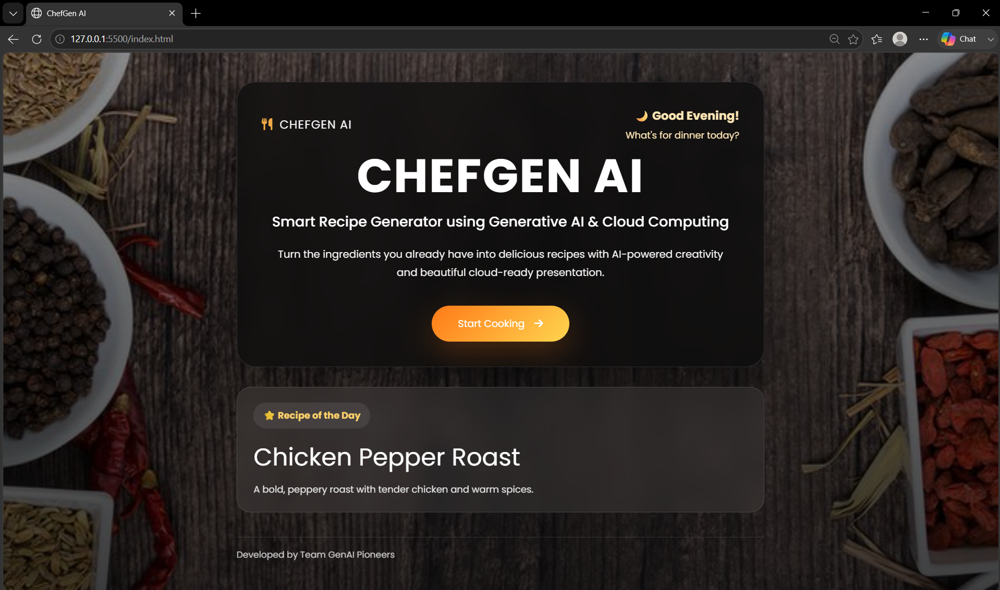
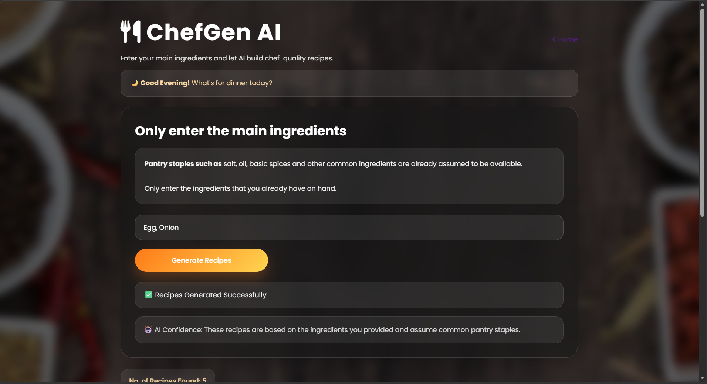
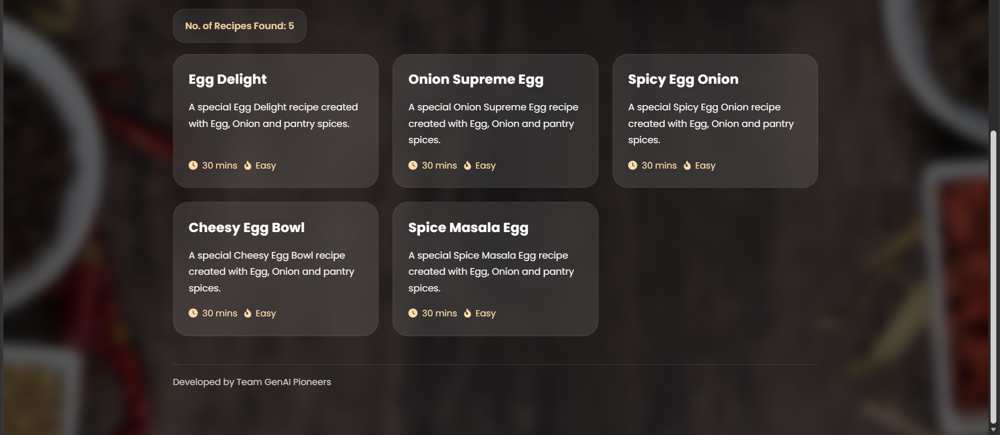
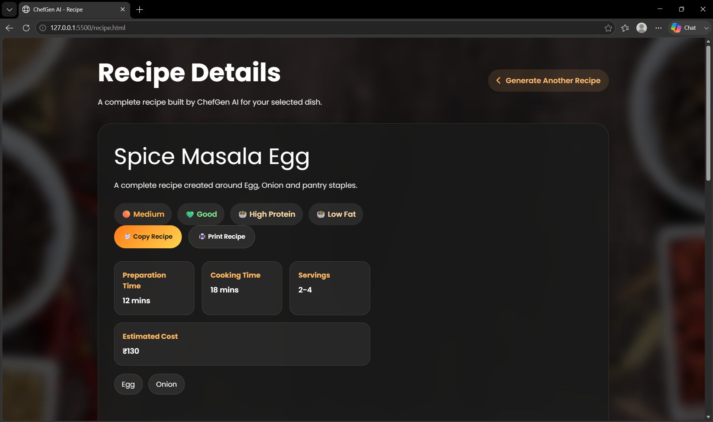
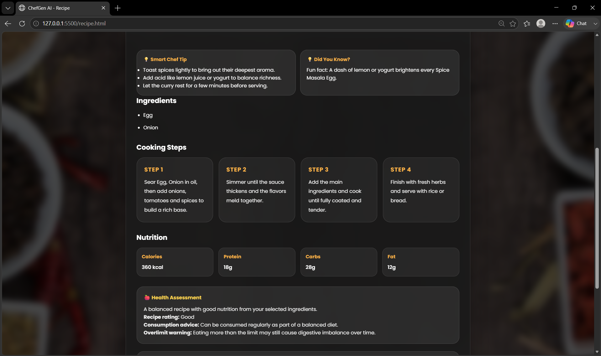
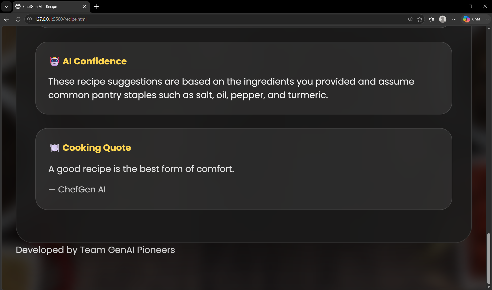

# 🍳 ChefGen AI

AI-powered Smart Recipe Generator using **Generative AI & Cloud Computing**

---

## 🌐 Live Demo

👉 **https://orugantiakshitha.github.io/ChefGen-AI/**

---

## 📸 App Demo

<p align="center">
  
</p>

<p align="center">
  
</p>

<p align="center">
  
</p>

<p align="center">
  
</p>

<p align="center">
  
</p>

<p align="center">
  
</p>

---

## 🌍 Live Demo →

**https://orugantiakshitha.github.io/ChefGen-AI/**

---

# 📖 Table of Contents

- About
- Features
- Technology Stack
- Project Structure
- Installation
- Configuration
- Running the Project
- Screenshots
- Future Enhancements
- Deployment
- License
- Author

---

# 🍽 About

ChefGen AI is a modern AI-powered recipe generator that helps users discover recipes using ingredients available at home.

Simply enter your available ingredients, and ChefGen AI intelligently creates:

- Complete recipes
- Step-by-step cooking instructions
- Cooking time
- Difficulty level
- Nutrition information
- Chef recommendations
- Cooking tips

Powered by **Google Gemini 2.5 Flash**, the application generates context-aware recipes while providing a local fallback mode when an API key is unavailable.

---

# ✨ Features

## 🏠 Beautiful Landing Page

- Full-screen hero section
- Modern glassmorphism design
- Responsive layout
- Smooth animations
- Attractive orange theme

---

## 🥗 Ingredient Input

- Add multiple ingredients
- Remove ingredients
- Input validation
- Animated ingredient chips
- Smart pantry assumptions

---

## 🤖 AI Recipe Generation

Powered by **Google Gemini 2.5 Flash**

Generates:

- Recipe Name
- Description
- Ingredients
- Step-by-Step Instructions
- Preparation Time
- Cooking Time
- Total Time
- Difficulty
- Servings
- Calories
- Protein
- Carbohydrates
- Fat
- Chef Tips
- Recipe Variations

---

## 🍛 Smart Recipe Logic

Examples:

| Ingredients | Generated Recipe |
|-------------|-----------------|
| Milk + Coffee | Coffee |
| Milk + Sugar | Sweet Milk Drink |
| Tomato + Onion | Tomato Curry |
| Egg + Bread | Egg Toast |
| Rice + Vegetables | Fried Rice |
| Chicken + Spices | Chicken Curry |

Masala Tea is only generated if ingredients such as ginger or cardamom are included.

---

## 🧠 Pantry Staples

The application automatically assumes common pantry ingredients are available:

- Salt
- Water
- Oil
- Pepper
- Basic spices

Users only need to enter their primary ingredients.

---

## 📄 Recipe Details

Every recipe includes:

- Recipe Image Placeholder
- Description
- Ingredients List
- Cooking Steps
- Nutrition Facts
- Cooking Tips
- Chef Suggestions

---

## 🔄 Offline Fallback Mode

If no Gemini API Key is configured:

- Loads sample recipes
- Fully functional demonstration
- No errors
- Great for testing

---

## 📱 Responsive Design

Supports:

- Desktop
- Laptop
- Tablet
- Mobile

---

## 📸 Project Screenshots

### 🏠 1. Landing Page


---

### 🥗 2. Ingredients Page


---

### 🍽️ 3. Recipe Cards


---

### 📖 4. Recipe Details Overview


---

### 👨‍🍳 5. Cooking Steps & Nutrition


---

### 🤖 6. AI Confidence & Footer


---

## 🎨 UI Features

- Glassmorphism
- Hover Animations
- Smooth Transitions
- Loading Spinner
- Gradient Buttons
- Modern Cards
- Responsive Navigation

---

# 🛠 Technology Stack

### Frontend

- HTML5
- CSS3
- Vanilla JavaScript (ES6)

### AI

- Google Gemini 2.5 Flash API

### Hosting

- Firebase Hosting
- Live Server

### Development Tools

- Visual Studio Code
- Git
- GitHub

---

# 📂 Project Structure

```
ChefGen-AI/
│
├── index.html
├── ingredients.html
├── recipe.html
│
├── css/
│   ├── style.css
│   ├── ingredients.css
│   └── recipe.css
│
├── js/
│   ├── app.js
│   ├── ingredients.js
│   ├── recipe.js
│   ├── gemini.js
│   └── config.js
│
├── data/
│   └── sampleRecipes.json
│
├── assets/
│   ├── background.jpg
│   ├── logo.png
│   └── icons/
│
├── README.md
└── firebase.json
```

---

# ⚙ Installation

## Clone Repository

```bash
git clone https://github.com/yourusername/ChefGen-AI.git
```

Open the project:

```bash
cd ChefGen-AI
```

Open in VS Code.

---

# 🔑 Configure Gemini API

Open:

```
js/config.js
```

Replace:

```javascript
const API_KEY = "YOUR_GEMINI_API_KEY";
```

with

```javascript
const API_KEY = "YOUR_ACTUAL_GEMINI_API_KEY";
```

You can obtain an API key from:

https://aistudio.google.com/

---

# ▶ Running the Project

### Method 1 (Recommended)

Install Live Server extension.

Right Click

```
index.html
```

Click

```
Open with Live Server
```

---

### Method 2

Deploy to Firebase Hosting.

---

# 📷 Screenshots

Add screenshots here.

Example:

```
screenshots/

landing-page.png

ingredients-page.png

recipe-page.png
```

---

# 🚀 Future Enhancements

- User Login
- Favorite Recipes
- Save Recipe History
- Dark Mode
- Voice Input
- AI Image Generation
- Shopping List Generator
- Meal Planner
- Nutritional Analysis
- Multi-language Support
- Recipe Sharing
- PDF Recipe Download
- Barcode Ingredient Scanner
- OCR Ingredient Detection
- Food Waste Reduction Suggestions

---

# 🌐 Firebase Deployment

Install Firebase CLI

```bash
npm install -g firebase-tools
```

Login

```bash
firebase login
```

Initialize

```bash
firebase init
```

Deploy

```bash
firebase deploy
```

---

# 📜 License

This project is created for educational and learning purposes.

Feel free to modify and enhance it.

---

# 👨‍💻 Author

**Team GenAI Pioneers**

Developed as an AI-powered Smart Recipe Generator using Google Gemini.

---

# ⭐ Support

If you found this project useful, consider giving it a ⭐ on GitHub.

Happy Cooking! 🍳